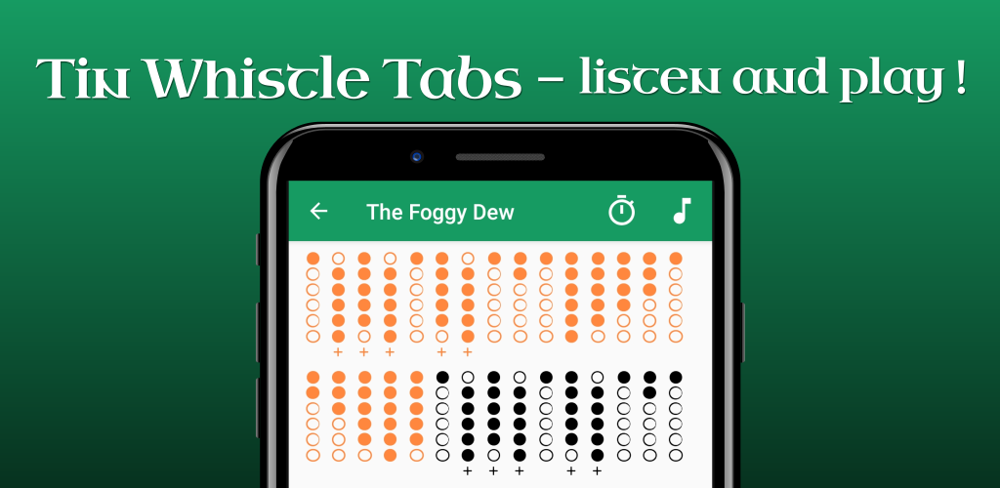

# Android app: Irish Whistle Tabs

Irish Whistle Tabs is an open-source tool to learn and improve your tin whistle skills. It features hundreds of traditional Celtic tunes (jigs, reels, polkas, ballads, etc.).

**Google play link**: https://play.google.com/store/apps/details?id=fr.charleslabs.tinwhistletabs

**Technical article link**: https://charleslabs.fr/en/project-Irish+Whistle+Tab+-+Android+app

This repo contains the Android Studio project and the database generator.

## ToDo

* Improve flute synth
* Add more tunes
* Add tunes request form
* Add sorting and filtering functions

## Technical details

The app uses the ABC music format.

To print the tabs, the ABC files are pre-processed by the "abc2db.py" script that does and intermediate conversion to MIDI, and then to text. This makes it easy to synthesise the tunes and show the tabs. The ABC format is also used in the app to show the sheet music.

## Libraries

The database generator uses:
* Python3 (with json, os, mido and re)
* abc2midi (GNU GPL)
* TheSession.org tunes (ODbL v1.0, https://github.com/adactio/TheSession-data)

The app uses:
* abcjs (MIT, https://github.com/paulrosen/abcjs)
* Tin Whistle Tab font (© Blayne Chastain, www.blaynechastain.com)
* Uncial Antiqua font (SIL Open Font License, Version 1.1)
